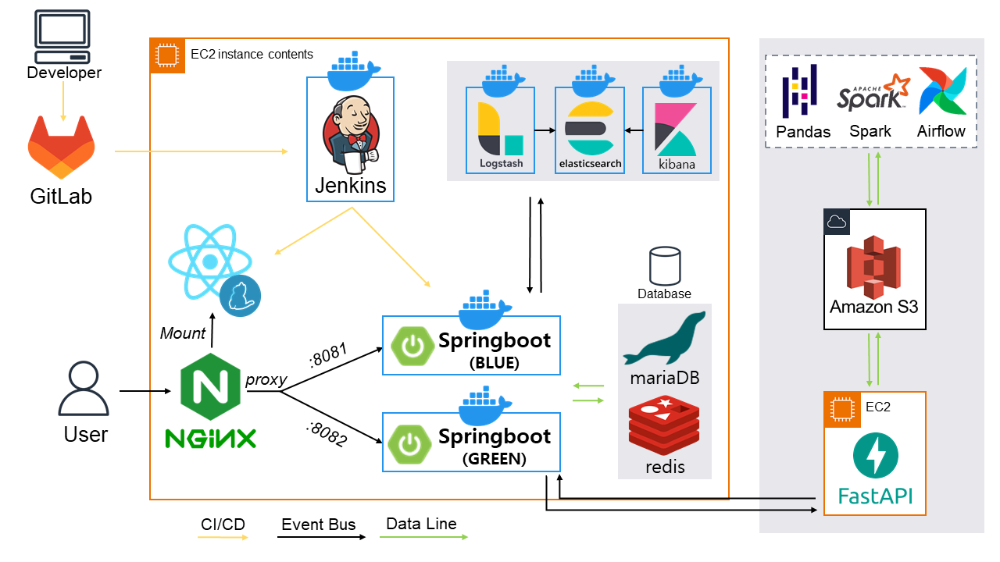
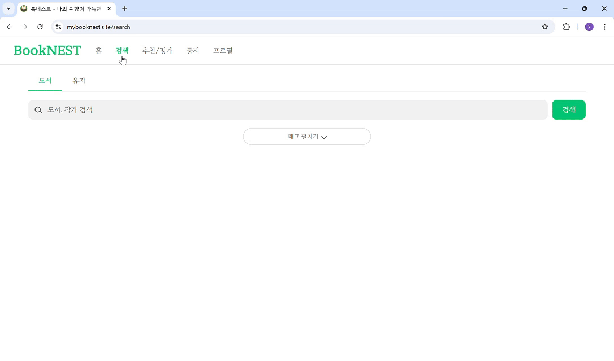

# 🪹 BookNest - 당신의 다음 책을 먼저 건네는 서비스

> **나의 취향이 가득한 책 둥지를 틀다.**  
> BookNest는 감성, 주제, 세계관을 이해하고  
> 사용자보다 먼저 ‘지금 딱 어울리는 책’을 추천하는  
> **개인 맞춤형 도서 추천 서비스**입니다.

---

## 프로젝트 개요

우리는 이미 넷플릭스, 스포티파이 같은 서비스가  
**개인의 취향을 이해하고 먼저 콘텐츠를 제안하는 시대**에 살고 있습니다.

하지만 책은 여전히,  
**내가 일일이 찾아야 하는 대상**으로 남아 있습니다.

**BookNest**는 그런 고민에서 출발했습니다.  
_"책은 많은데, 지금 나한테 맞는 책은 뭘까?"_  
_"단지 베스트셀러가 아니라, 내 감정에 맞는 책을 누군가 먼저 추천해줬으면..."_

---

## 핵심 문제의식

 **기존 도서 추천 시스템의 한계**:
- 베스트셀러 중심: 인기 책만 반복적으로 노출
- 단순 키워드 매칭: 책의 분위기나 감정은 반영하지 않음
- 정적인 설문 기반: 사용자의 실제 행동은 반영되지 않음

---

## 🪽 BookNest의 해결 방식

### 책을 이해하는 방식: 태그 기반 감성 분석
- 단순 장르 분류가 아닌, **감정, 분위기, 주제, 흐름, 세계관**까지 총 **6가지 층위의 태그 체계 설계**
- 도서 서평, 소개 문장 등 **정서 중심 텍스트**를 기반으로 **LLM 분석**
- **Ko-RoBERTa, CluE** 등의 한국어 사전학습 모델을 이용하여 **문맥 기반 태그 자동 생성**

### 사용자를 이해하는 방식: 행동 로그 기반 취향 벡터
- 사용자의 모든 행동 로그를 분석해 **정량화**:
  - **찜**: 약한 선호
  - **한줄평/별점**: 강한 감정 표현
  - **‘관심 없음’**: 명확한 비선호
- **실시간으로 Redis에 반영**되어, 즉각적인 추천 결과 변화 가능

### 추천 전략: 실시간 + 배치 추천의 하이브리드
- **실시간 추천**: 사용자의 행동에 따라 태그 선호도가 바로 업데이트됨
- **배치 기반 추천**: 매일 자정, 사용자 로그와 책 태그 데이터를 바탕으로 **LightFM 추천 모델** 학습

---

## 🪶 사람마다 다른 독서 성향: 아키타입 기반 맞춤 전략

사람마다 책을 고르는 기준은 전혀 다릅니다.  
누군가는 스토리의 전개에,  
누군가는 메시지나 설정, 분위기에 더 이끌립니다.

그래서 **BookNest**는 다음과 같은 **8가지 독서 유형(Archetype)**을 정의하고,  
각 유형별로 **추천 기준과 가중치를 차별화**합니다.
> 예: ‘따뜻한 감성가’는 잔잔한 성장 서사를 선호하고,  
> ‘세계관 탐험가’는 복잡한 설정과 서사 구조를 좋아합니다.
 

| 아키타입        | 이미지                                               | 글귀                                                       | 독자 성향                                                      |
|-----------------|------------------------------------------------------|------------------------------------------------------------|---------------------------------------------------------------|
| **독창적 실험가  카나리아**     |  | **"이 문장을 읽는 순간, 당신은 나의 독자가 된다. 그러므로 나는 당신을 창조할 수 있다."**   — 이탈로 칼비노, 『어느 겨울밤 한 여행자가』 | 창조적이고 실험적인 방식으로 새로운 것을 시도하는 독자 |
| **세계관 탐험가  알바트로스**   |  | **"길을 나서지 않으면 결코 알 수 없다. 세상은 너무나도 넓으니까."**   — J.R.R. 톨킨, 『반지의 제왕』 | 복잡한 세계관과 설정을 탐구하며 모험을 즐기는 독자 |
| **현실주의자  독수리**       |  | **“글쎄요, 난 이곳에서 당신들이 누리는 그런 거짓된 가짜 행복을 느끼기보다는 차라리 불행해지고 싶은데요.”**   — 올더스 헉슬리, 『멋진 신세계』 | 사회적 문제를 분석하고 현실을 냉철하게 바라보는 독자 |
| **따뜻한 감성가  흰 오목눈이**   |  | **"네가 사랑하는 것은 너를 울게 한다. 하지만 결국 너를 가장 강하게 만드는 것도 그것이다."**   — 빅토르 위고, 『노트르담 드 파리』 | 감동적이고 따뜻한 이야기나 감정적 교감을 중요시하는 독자 |
| **논리적 사색가  부엉이**       |  | **"진정으로 아는 사람은 자기가 모른다는 것을 아는 사람이다."**   — 소크라테스, 『소크라테스의 변론』 | 논리적이고 철학적인 사고를 즐기며 깊이 있는 사색을 좋아하는 독자 |
| **냉철한 분석가  까마귀**       |  | **"진실은 종종 가장 보이지 않는 곳에 숨겨져 있다."**   — 아서 코난 도일, 『셜록 홈즈』 시리즈 | 미스터리와 반전을 즐기며, 사실을 파헤치는 과정을 좋아하는 독자 |
| **명랑한  이야기꾼  앵무새**       |  | **"약간의 어리석음은 괜찮아. 우리는 모두 조금씩 이상하니까."**   — 루이스 캐럴, 『이상한 나라의 앨리스』 | 유머와 즐거운 이야기를 선호하는 가볍고 긍정적인 독자 |
| **감각의 여정자 플라밍고**     |  | **”이 광대한 우주 무한한 시간 속에서 당신과 같은 시간, 같은 행성 위에 살아가는 것을 기뻐하며”**   — 칼 세이건, 『코스모스』 | 감각적이고 신비로운 분위기를 선호하며, 초현실적인 이야기에 이끌리는 독자 |

---

## ℹ️ 데이터 출처 및 활용 방식

- **공공도서관 대여 이력** (2020~2024)
- **소장 도서 목록** (KDC, ISBN, 작가, 출판일 포함)
- **YES24, 교보문고 리뷰, 서평, 책 소개 크롤링 데이터**
- 전체 약 수십만 건 이상의 실제 데이터 기반

데이터는 아래와 같이 활용됩니다:

| 데이터 유형        | 사용 목적 |
|--------------------|-----------|
| 서평/소개 문장      | 감성 태그 추출 (LLM 분석) |
| 대여 이력 로그      | 작가/카테고리/태그 기반 사용자 선호 분석 |
| 행동 로그          | 실시간 및 배치 추천 학습 데이터 |

---
## ⚙️ 시스템 아키텍처

---

## 💻 주요 페이지 구성

| 페이지            | 주요 기능 |
|------------------|-----------|
| **로그인 페이지**     | 감각적인 UI, 소셜 로그인 지원 (카카오, 구글, 네이버) |
| **메인 페이지**       | 필터링 기반 도서 추천 |
| **검색 페이지**       | 일반 검색, 태그 검색 |
| **실시간 도서 추천 페이지** | 유저의 행동 데이터를 기반으로 실시간 도서 추천 |
| **둥지 페이지**       | 기록하고 싶은 도서를 보관 |
| **프로필 페이지**     | 프로필 정보 수정, 내가 준 평점/한줄평, 아키타입 분석 |
| **도서 상세보기 페이지** | 도서 평점 주기, 찜하기, 서재 담기, 구매 가능한 온라인 서점 연결, 한줄평 기능능 |

 

### **1. 로그인 페이지**

**기능:**
- 감각적인 UI로 사계절 내내 사용자의 독서를 장려하는 디자인
- **소셜 로그인**: 카카오, 구글, 네이버 로그인 지원

---

### **2. 메인 페이지**

**기능:**
- **추천 도서 필터링**:
  - 오늘의 추천 도서
  - 유저가 많이 읽은 카테고리 도서
  - 성별/나이대 기반 추천
  - 스테디셀러 추천
  - 화제의 작가 도서
  - 유명 평론가 추천 도서
  - 랜덤 태그별 추천
  - 공공 도서관 인기 도서

---

### **3. 검색 페이지**
#### 3.1 일반 검색

**기능:**
- 도서 및 작가 검색
- **최근 검색어** 기능
- **실시간 인기 검색어** 제공

#### 3.2 태그 검색

**기능:**
- 태그별 도서 검색
- **태그 + 검색어**로 맞춤 검색 가능

---

### **4. 실시간 도서 추천**

**기능:**
- 유저의 행동을 분석하여 실시간으로 맞춤 도서를 추천합니다.
- 특정 **태그의 도서를 자주 검색**하거나 **둥지에 담은 태그**에 맞춰 추천

---

### **5. 둥지 페이지**

**기능:**
- 유저가 읽고 기록하고 싶은 도서를 보관하는 페이지
- **정렬 옵션**:
  - 최근 담은 순
  - 오래된 순
  - 제목 순
  - 평점 순
- **도서 검색 후 바로 추가** 가능
- **평점**과 **한줄평**을 한 번에 볼 수 있음

---

### **6. 프로필 페이지**

**기능:**
- **프로필 이미지** 수정
- **내가 평점 준 책** 및 **한줄평** 남긴 책 확인
- **아키타입 분석** (내 도서 타입 분석)
- **자주 읽은 도서 태그** 워드 클라우드 표시
- **선호 작가** 및 **팔로우/팔로워** 기능
- 다른 유저 검색 및 **평점/한줄평 목록** 보기
- 다른 유저의 **둥지 보기**

---

### **7. 도서 상세보기 페이지**

**기능:**
- 도서 평점 주기
- **찜하기** 기능
- **서재 담기** 기능
- **구매 가능한 서재 가기**
- 도서 정보 보기
- **한줄평 작성 및 수정/삭제** 가능

---

### 📱**반응형 UI 구현**

- **모바일 버전**에서의 반응형 UI를 구현하여, 다양한 화면 크기에서 잘 동작하도록 최적화된 UI를 제공합니다.
- 각 페이지가 **화면 비율**에 따라 **원활하게 동작**하며, **사용자의 편의성**을 고려하여 최적화되었습니다.

  
---

## 🪺 기대 효과

- 사용자 맞춤형 독서 경험 제공
- 감정과 취향의 흐름에 따른 추천 실현
- 단순히 ‘좋은 책’이 아닌 ‘지금 필요한 책’ 추천
- 데이터 기반 개인 독서 히스토리 구축

---

## 👨‍👩‍👧‍👦 TEAM - **빅진따** (빅데이터 진짜 따뜻함)

| 이름     | 역할             |
|----------|------------------|
| 민승용   | 팀장 / 프론트엔드 |
| 이은지   | 인프라 / 백엔드   |
| 류현웅   | 데이터           |
| 조성욱   | 데이터           |
| 이경석   | 백엔드           |
| 정유진   | 프론트엔드       |

---

“북네스트는 당신의 취향을 기억하고,
당신의 마음이 머무는 자리에
가장 어울리는 책을 조용히 건넵니다.”

🕊 *“사람과 책을 태그로 연결한다 — BookNest”*
